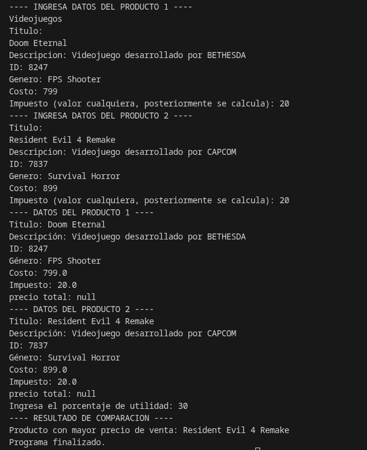

# Actividad 3 

Dentro de est repositorio se encuentra la documentación de la actividad 3, cuyo objetivo es aplicar los
conocimientos adquiridos en las sesiones para crear clases que incluyan métodos avanzados, así como para construir 
y usar objetos a partir de esas clases. 

---

## Instrucciones 

1. En Java, crea una clase llamada Producto con las siguientes características:
- La clase debe tener los siguientes atributos privados (private):

| Atributo         | Tipo |
|------------------|------|
|Descripción       | String |
| Código           | String |
|Tipo              | String |
| Costo            | double |
| Impuesto         | double |

- Incluye un método de acceso (get) para cada atributo privado. Recuerda que estos elementos devuelven el valor del atributo y, por tanto, deben ser públicos (public).

- Incluye un método “establecedor” (set) para cada atributo privado. Recuerda que estos elementos asignan un valor a los atributos, por lo que no devuelven ningún valor y, por ese motivo, también deben ser públicos.

- Incluye un método público llamado muestraProducto que presente el valor de todos los atributos en pantalla.

- Incluye un método funcional que calcule y devuelva el precio de venta del producto, de acuerdo con los siguientes requisitos:
    - El método debe recibir un parámetro de tipo double que se llame utilidad, cuyo valor corresponde al porcentaje de utilidad que se quiere manejar para el producto.

   - Al costo, se le debe sumar el porcentaje de utilidad; por ejemplo, si el primero es de $100 y la segunda de 20%, el precio antes de impuestos es de $120.

  - Finalmente, a dicho precio, se le debe sumar el impuesto; entonces, si este es del 16%, el precio de venta total se calcula a partir de la suma de $120 + $16.2, la cual arroja un total de $139.2. Este es el valor que debe devolver el método.

  - El nombre del método debe ser calcularPrecio.

2. En la clase principal (main) del programa, realiza las siguientes acciones:
- Crea dos objetos de la clase Producto, pide al usuario el valor de todos los atributos y asígnalos mediante los métodos establecedores (set).

- Incluye sentencias try-catch para captar excepciones que se puedan presentar en la entrada de datos.

- Muestra, en pantalla, los valores de los atributos de los dos objetos a través del método mostrarProducto().

- Crea un método estático llamado compararProductos que reciba dos parámetros de tipo Producto; dentro de él, invoca el método de clase calcularPrecio para cada uno de los productos recibidos como argumentos y, luego, determina cuál es mayor. El método debe devolver un String con la descripción del producto con el mayor precio de venta.

- Desde la clase principal (main), invoca el método compararProductos y muestra el resultado en la pantalla.

---

## Desarrollo de la actividad   

A continuación se presentan los códigos que fueron usados para desarrollar este programa, así como también sus respectivas salidas esperadas 

```java
public class Producto {

    // Atributos
    private String titulo;
    private String descripcion;
    private String idproducto;
    private String genero;
    private Double costo;
    private Double impuesto;
    private Double precioTotal;

    // Constructores
    
    // Constructor vacío

    public Producto() {
    }

    // Constructor 

    public Producto(String titulo, String descripcion, String idproducto, String genero, Double costo, Double impuesto, Double precioTotal) {
        this.titulo = titulo;
        this.descripcion = descripcion;
        this.idproducto = idproducto;
        this.genero = genero;
        this.costo = costo;
        this.impuesto = impuesto;
        this.precioTotal = precioTotal;

    }


    // Getters

    public String getTitulo() {
        return titulo;
    }

    public String getDescripcion() {
        return descripcion;
    }

    public String getIdProducto() {
        return idproducto;
    }

    public String getGenero() {
        return genero;
    }

    public Double getCosto() {
        return costo;
    }

    public Double getImpuesto() {
        return impuesto;
    }

    // Setters

    public void setTitulo(String titulo) {
        this.titulo = titulo;
    }

    public void setDescripcion(String descripcion) {
        this.descripcion = descripcion;
    }

    public void setIdProducto(String idproducto) {
        this.idproducto = idproducto;
    }

    public void setGenero(String genero) {
        this.genero = genero;
    }

    public void setCosto(Double costo) {
        this.costo = costo;
    }

    public void setImpuesto(Double impuesto) {
        this.impuesto = impuesto;
    }


    // Métodos


    public double calcularPrecio(double utilidad) {
        // Calcular impuesto
        double impuestoRecalculado = costo * 0.15;
        this.impuesto = impuestoRecalculado;

        // Calcular precio total
        double precioTotal = costo + impuestoRecalculado + (costo * utilidad / 100);
        return precioTotal;
    }

    public void mostrarInfo() {
        System.out.println("Titulo: " + titulo);
        System.out.println("Descripción: " + descripcion);
        System.out.println("ID: " + idproducto);
        System.out.println("Género: " + genero);
        System.out.println("Costo: " + costo);
        System.out.println("Impuesto: " + impuesto);
        System.out.println("precio total: " + precioTotal);
    }

}
```

---

El siguiente código presentado es para la clase **Main**, donde el usuario creará el producto

```Java
import java.util.InputMismatchException;
import java.util.Scanner;

public class Main {

    public static void main(String[] args) {

        Scanner sc = new Scanner(System.in);

        Producto p1 = new Producto();
        Producto p2 = new Producto();

        try { // try-catch para manejar posibles errores basicos de entrada 
            
            System.out.println("---- INGRESA DATOS DEL PRODUCTO 1 ----");
            productosteclado(sc, p1); // cargar datos del producto 1

            System.out.println("---- INGRESA DATOS DEL PRODUCTO 2 ----");
            productosteclado(sc, p2); // cargar datos del producto 2

            System.out.println("---- DATOS DEL PRODUCTO 1 ----");
            p1.mostrarInfo();

            System.out.println("---- DATOS DEL PRODUCTO 2 ----");
            p2.mostrarInfo();
            
            System.out.print("Ingresa el porcentaje de utilidad: ");
            double utilidad = sc.nextDouble();
            
            String ProductoMayor = compararProductos(p1, p2, utilidad);

            System.out.println("---- RESULTADO DE COMPARACION ----");
            System.out.println("Producto con mayor precio de venta: " + ProductoMayor);

        } catch (InputMismatchException e) { // manejo de error en caso de ingresar un dato incorrecto (como texto en lugar de número)
            System.out.println(" Error: Ingresaste un dato incorrecto.");
        
        } catch (Exception e) { // manejo de cualquier otro error inesperado
            System.out.println(" Ocurrió un error ");

        } finally { // finally para finalizar el programa, cerrando scanner 
            sc.close();
            System.out.println("Programa finalizado.");
        }
    }

    
    private static void productosteclado(Scanner sc, Producto p) { // Método auxiliar para no repetir código

        sc.nextLine(); 

        System.out.println("Titulo: ");
        p.setTitulo(sc.nextLine());

        System.out.print("Descripcion: ");
        p.setDescripcion(sc.nextLine());

        System.out.print("ID: ");
        p.setIdProducto(sc.nextLine());

        System.out.print("Genero: ");
        p.setGenero(sc.nextLine());

        System.out.print("Costo: ");
        p.setCosto(sc.nextDouble());

        System.out.print("Impuesto (valor cualquiera, posteriormente se calcula): ");
        p.setImpuesto(sc.nextDouble());
    }

    
    public static String compararProductos(Producto a, Producto b, double utilidad) { // Para comparar dos productos por su precio

        double precioA = a.calcularPrecio(utilidad); 
        double precioB = b.calcularPrecio(utilidad);

        if (precioA > precioB) {
            return a.getTitulo();
        } else if (precioB > precioA) {
            return b.getTitulo();
        } else { // si ambos precios son iguales 
            return "Ambos productos tienen el mismo precio de venta";
        }
    }
}
```


---

